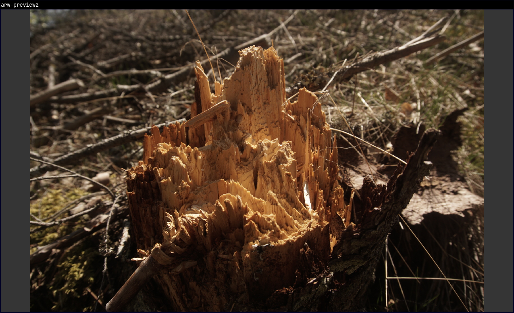

Quickly preview raw camera image files

## Supported image files
- .ARW by Sony a6000
- .CR3 by Canon EOS R50

Raw image files created by other camera models have not been tested.

## Controls
Mouse click to move, double-click to fit image\
`Escape` or `Caps Lock` or `q` to exit\
`Arrow up` or `+` zoom in\
`Arrow down` or `-` zoom out\
`WASD` or `Ctrl + Arrow key` to move\
`Double click` or `Space` or `Enter` to fit image\
`HJKL` keys double as arrow keys, for the VIM enjoyers\
`Shift` to show framerate



## Building
Install [Odin](https://odin-lang.org/) version dev-2025-03
```
odin build . -o:speed
```

## Running
```
./arw-preview2 example.ARW
# or
./arw-preview2 example.CR3
```

## Todo
- Right click -> Copy to clipboard
- Multiple files
- Timing outputs in --verbose

The included [Inter](fonts/Inter/Inter-Regular.ttf) font is licensed under the OFL-1.1. A copy of this license is included in [fonts/Inter/LICENSE.txt](fonts/Inter/LICENSE.txt)
